### Jonas Strabel

Software engineer with a B.Sc. in Computer Science (DHBW Mannheim, dual study with Roche Diagnostics). On GitHub since 2019 — though a lot of my earlier work lived in company and university repos.

Currently studying philosophy at Sankt Georgen and working as a data analyst at MedifoxDan. In my spare time I build — mainly [**AccountyCat**](https://accountycat.com), an open-source (MIT) macOS focus companion.

Long-term, I want to help build toward a future where more people get to spend their time on work that's meaningful to them.

